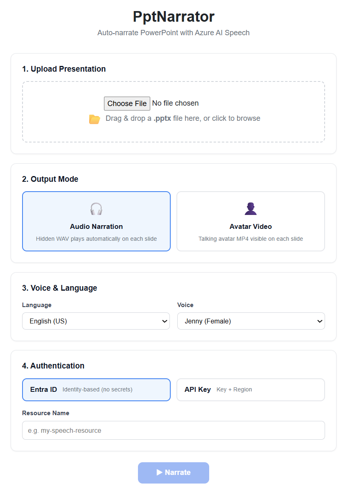

# PptNarrator – Auto-Narrate PowerPoint with Azure AI Speech

**PptNarrator** automatically narrates PowerPoint presentations using [Azure AI Speech](https://learn.microsoft.com/azure/ai-services/speech-service/). It reads speaker notes from each slide, generates **audio (WAV)** or **talking avatar video (MP4)**, and embeds the media directly into a copy of the PPTX so it **auto-plays during slideshow**.

Available as a **.NET 8 console app** and a **Blazor Server web app** — same narration engine, two interfaces.

Key features:
- **Audio mode** — generates hidden WAV narration that plays automatically on each slide, just like PowerPoint's built-in Record Narration.
- **Avatar mode** — generates a photorealistic talking-avatar MP4 video visible on each slide.
- **Web UI** — upload a PPTX in your browser, configure voice/avatar settings, and download the narrated file.
- Supports both **API Key** and **Microsoft Entra ID** authentication.
- The original file is never modified — a new file with `-narrated` in the name is created.

This repository also includes standalone **PowerShell scripts** for batch-converting SSML files to audio or avatar video outside of PowerPoint (see [PowerShell Scripts](#powershell-scripts--manual-tts--avatar)).

## Repository Structure

```
├── AIspeech.sln                # Solution file
├── PptNarrator/                # .NET 8 console app – auto-narrate PowerPoint slides
│   ├── PptNarrator.csproj      # Project file (.NET 8)
│   ├── Program.cs              # CLI entry point & orchestration
│   ├── AppOptions.cs           # Command-line options
│   ├── NoteExtractor.cs        # Extracts speaker notes from PPTX
│   ├── SsmlBuilder.cs          # Generates SSML from plain text
│   ├── SpeechService.cs        # Azure TTS & Avatar API calls
│   ├── SlideMediaEmbedder.cs   # Embeds audio/video into PPTX slides
│   ├── input/                  # ⬆ Place your .pptx files here
│   └── output/                 # ⬇ Narrated .pptx files appear here
├── PptNarrator.Web/            # Blazor Server web app – browser-based UI
│   ├── PptNarrator.Web.csproj  # Project file (.NET 10)
│   ├── Program.cs              # Web host entry point
│   ├── Services/
│   │   └── NarrationService.cs # Orchestrates the narration pipeline for the web UI
│   └── Components/
│       ├── App.razor            # HTML shell & JS interop
│       ├── Layout/
│       │   └── MainLayout.razor # Page layout
│       └── Pages/
│           ├── Home.razor       # Main upload & narration page
│           └── Home.razor.css   # Scoped styles
└── ps-scripts/                 # Standalone PowerShell scripts
    ├── text-to-speech-apikey.ps1   # TTS script – API Key authentication
    ├── text-to-speech-entraid.ps1  # TTS script – Entra ID authentication
    ├── avatar-apikey.ps1           # Avatar script – API Key authentication
    ├── avatar-entraid.ps1          # Avatar script – Entra ID authentication
    ├── ssml/                       # Input  – place your SSML XML files here
    │   └── sample.xml              # Example SSML file
    ├── audio/                      # Output – generated WAV files (auto-created)
    └── video/                      # Output – generated avatar MP4 videos (auto-created)
```

## Prerequisites

- An **Azure AI Speech** resource in your Azure subscription
- [.NET 8 SDK](https://dotnet.microsoft.com/download/dotnet/8.0) or later (for the console app)
- [.NET 10 SDK](https://dotnet.microsoft.com/download/dotnet/10.0) (for the web app)

### Create an Azure AI Speech Resource

1. Open the [Azure Portal](https://portal.azure.com/) and create an **Azure AI Speech** resource  
   (**Create a resource → AI + Machine Learning → Speech**).
2. Choose a **Region** (e.g. `swedencentral`, `eastus`) and a **Pricing tier**.
3. Note the following values from the resource's **Keys and Endpoint** page:

   | Value | Where to find it | Used by |
   |---|---|---|
   | **Region** | Overview / Keys and Endpoint | API Key auth |
   | **Key 1** or **Key 2** | Keys and Endpoint | API Key auth |
   | **Resource name** | Resource name at the top of the Overview page | Entra ID auth |

4. **If you plan to use Entra ID authentication**, you must also enable a **Custom domain** on the resource:
   - Go to **Networking → Custom domain name** and set a unique subdomain.
   - Once enabled, the endpoint becomes `https://<resource-name>.cognitiveservices.azure.com`.

### Entra ID Setup (optional)

If you prefer identity-based authentication (no API keys), complete these additional steps:

1. **Install the Az.Accounts PowerShell module** (one-time):

   ```powershell
   Install-Module Az.Accounts -Force -Scope CurrentUser -AllowClobber
   ```

2. **Sign in to Azure:**

   ```powershell
   Connect-AzAccount
   ```

   If the Speech resource is in a specific subscription, select it:

   ```powershell
   Set-AzContext -Subscription "<SUBSCRIPTION-ID>"
   ```

3. **Assign the RBAC role** on the Speech resource (requires an Owner or User Access Administrator):

   ```powershell
   New-AzRoleAssignment `
     -SignInName "<YOUR-EMAIL>" `
     -RoleDefinitionName "Cognitive Services Speech User" `
     -Scope "/subscriptions/<SUB-ID>/resourceGroups/<RG-NAME>/providers/Microsoft.CognitiveServices/accounts/<RESOURCE-NAME>"
   ```

   Alternatively, assign the role in the Azure Portal:
   - Navigate to the Speech resource → **Access control (IAM)** → **Add role assignment**.
   - Role: **Cognitive Services Speech User**
   - Assign to your user account.

4. **Enable a Custom domain** on the Speech resource (see above).  
   Entra ID authentication **only works with the custom-domain endpoint** — NOT the regional endpoint.

### Authentication Comparison

| | API Key | Entra ID |
|---|---|---|
| **Ease of setup** | Simple — just paste the key | Requires module install, login, and RBAC |
| **Security** | Key can be leaked if committed to source control | No secrets in code — uses identity-based auth |
| **Endpoint (TTS)** | Regional (`<region>.tts.speech.microsoft.com`) | Custom domain (`<name>.cognitiveservices.azure.com`) |
| **Endpoint (Avatar)** | Regional (`<region>.api.cognitive.microsoft.com`) | Custom domain (`<name>.cognitiveservices.azure.com`) |
| **Custom domain required** | No | Yes |
| **RBAC role required** | No | Yes — "Cognitive Services Speech User" |
| **Works when API keys disabled** | No | Yes |

---

## PptNarrator

### Input & Output Folders

| Folder | Path | Purpose |
|---|---|---|
| **Input** | `PptNarrator/input/` | Place your `.pptx` file(s) here before running the app |
| **Output** | `PptNarrator/output/` | The narrated `.pptx` files are saved here automatically |

> **Tip:** Each slide that has **speaker notes** will get narration. Slides without notes are left unchanged.

### How to Run

From the `PptNarrator/` directory:

```powershell
dotnet run -- <input-file> [options]
```

Or build first and run the executable:

```powershell
dotnet build
.\bin\Debug\net8.0\PptNarrator.exe <input-file> [options]
```

### Command-Line Options

| Option | Values | Default | Description |
|---|---|---|---|
| `<input-file>` | path to `.pptx` | *(required)* | The PowerPoint file to narrate. Place it in `input/` for convenience. |
| `--mode` | `audio` \| `avatar` | `audio` | **audio** — generates WAV narration (hidden, plays automatically during slideshow). **avatar** — generates MP4 talking-avatar video (visible on slide, plays automatically). |
| `--auth` | `apikey` \| `entraid` | `entraid` | **apikey** — authenticates with an Azure Speech API key. **entraid** — authenticates with your Azure AD / Entra ID identity (requires `az login`). |
| `--voice` | voice name | `en-US-JennyNeural` | The neural TTS voice to use. See the [Voice Gallery](https://speech.microsoft.com/portal/voicegallery) for all available voices. Must match the language specified in `--lang`. |
| `--lang` | language code | `en-US` | Language/locale code for the SSML markup (e.g. `ja-JP`, `zh-CN`, `de-DE`). Must match the voice. |
| `--region` | Azure region | — | Azure region of your Speech resource (e.g. `swedencentral`, `eastus`). **Required when `--auth apikey`**. |
| `--api-key` | key string | — | API key (Key 1 or Key 2) from the Azure Portal. **Required when `--auth apikey`**. |
| `--resource-name` | resource name | — | Name of your Azure Speech resource. **Required when `--auth entraid`**. |
| `--avatar-character` | character name | `lisa` | Avatar character to use (avatar mode only). See [available avatar characters](https://learn.microsoft.com/en-us/azure/ai-services/speech-service/text-to-speech-avatar/standard-avatars). |
| `--avatar-style` | style name | `graceful-sitting` | Avatar style (avatar mode only, for standard video avatars). See [available avatar styles](https://learn.microsoft.com/en-us/azure/ai-services/speech-service/text-to-speech-avatar/standard-avatars). Leave default for photo avatars. |
| `--output` | file path | `output/<name>-narrated.pptx` | Custom path for the output file. If omitted, the narrated file is saved to the `output/` folder. |

### Example Commands

#### Audio narration with Entra ID authentication

```powershell
cd PptNarrator
dotnet run -- input\presentation.pptx --auth entraid --resource-name my-speech-resource
```

Output: `output\presentation-narrated.pptx`

#### Audio narration with API Key authentication

```powershell
cd PptNarrator
dotnet run -- input\presentation.pptx --auth apikey --region swedencentral --api-key YOUR_API_KEY
```

Output: `output\presentation-narrated.pptx`

#### Avatar video with Entra ID authentication

```powershell
cd PptNarrator
dotnet run -- input\presentation.pptx --mode avatar --auth entraid --resource-name my-speech-resource
```

Output: `output\presentation-narrated.pptx` (with avatar video on each slide)

#### Custom voice and language (Japanese)

```powershell
cd PptNarrator
dotnet run -- input\slides.pptx --auth entraid --resource-name my-speech-resource --voice ja-JP-NanamiNeural --lang ja-JP
```

#### Custom avatar character and output path

```powershell
cd PptNarrator
dotnet run -- input\deck.pptx --mode avatar --auth apikey --region eastus --api-key KEY --avatar-character harry --avatar-style business --output C:\Presentations\final.pptx
```

### How It Works

```
input\presentation.pptx
         │
         ▼
  ┌──────────────┐    Speaker notes text
  │ NoteExtractor │──────────────────────┐
  └──────────────┘                       │
         │                               ▼
         │                      ┌─────────────┐   SSML markup
         │                      │ SsmlBuilder  │──────────┐
         │                      └─────────────┘           │
         │                                                ▼
         │                                     ┌────────────────┐
         │                                     │ SpeechService  │
         │                                     │ (TTS / Avatar) │
         │                                     └───────┬────────┘
         │                                             │  .wav / .mp4
         ▼                                             ▼
  ┌──────────────────┐    Embed media into PPTX copy
  │ SlideMediaEmbedder│◀───────────────────────────────┘
  └──────────────────┘
         │
         ▼
output\presentation-narrated.pptx
  (auto-plays narration in slideshow)
```

> **Audio mode:** The audio is embedded as a hidden narration element — it plays automatically  
> when you advance to that slide in slideshow mode, just like PowerPoint's built-in Record Narration.
>
> **Avatar mode:** The avatar video is embedded as a visible video element on the top-right  
> corner of each slide. It also plays automatically when the slide is shown.

---

## PptNarrator.Web — Browser UI

The **PptNarrator.Web** project is a Blazor Server web app that wraps the same narration engine in a browser-based interface. It references the `PptNarrator` project directly — no code duplication.

### How to Run

```powershell
cd PptNarrator.Web
dotnet run
```

The app opens your default browser automatically. If it doesn't, navigate to the URL shown in the terminal (e.g. `http://localhost:5225`).

### Web UI Workflow

1. **Upload** — drag & drop or browse for a `.pptx` file (up to 200 MB).
2. **Output Mode** — choose **Audio Narration** (hidden WAV) or **Avatar Video** (visible MP4).
3. **Voice & Language** — select from 11 languages with male/female voice options.
4. **Avatar Settings** *(avatar mode only)* — pick a character and style from the same set listed in [Avatar Types](#avatar-types).
5. **Authentication** — enter either **Entra ID** (resource name) or **API Key** (region + key) credentials.
6. **Narrate** — click the button. A progress bar and live log show the status for each slide.
7. **Download** — when complete, a Save As dialog lets you choose where to save the narrated `.pptx`.

### Screenshot

The web UI provides a single-page form with numbered steps, mode selection cards, voice/avatar dropdowns, and real-time processing feedback.



---

## PowerShell Scripts — Manual TTS & Avatar

The `ps-scripts/` folder contains standalone PowerShell scripts for calling the Azure AI Speech REST API directly. Use these when you want to batch-convert SSML files to audio or avatar video **outside of PowerPoint**.

### SSML Input Files

Place one or more `.xml` files in the `ps-scripts/ssml/` folder. Each file must contain valid [SSML](https://learn.microsoft.com/azure/ai-services/speech-service/speech-synthesis-markup-structure).

Example (`ps-scripts/ssml/sample.xml`):

```xml
<speak version="1.0" xml:lang="en-US">
  <voice name="en-US-JennyNeural">
    <prosody rate="0%" pitch="0%">
      Hello! This is a sample SSML file for Azure AI Speech text-to-speech.
    </prosody>
  </voice>
</speak>
```

> A full list of available voices can be found in the [Voice Gallery](https://speech.microsoft.com/portal/voicegallery).

### Text-to-Speech

#### API Key Authentication

Open `ps-scripts/text-to-speech-apikey.ps1` and set the two variables at the top:

```powershell
$region = "<YOUR-REGION>"       # e.g. "swedencentral"
$apiKey = "<YOUR-API-KEY>"      # Key 1 or Key 2 from the Azure Portal
```

```powershell
cd ps-scripts
.\text-to-speech-apikey.ps1
```

#### Entra ID Authentication

Open `ps-scripts/text-to-speech-entraid.ps1` and set the variable at the top:

```powershell
$resourceName = "<YOUR-SPEECH-RESOURCE-NAME>"   # e.g. "my-speech-resource"
```

```powershell
cd ps-scripts
.\text-to-speech-entraid.ps1
```

#### TTS Output

Generated WAV files are saved in the `ps-scripts/audio/` folder with the same base name as the input SSML file:

```
ps-scripts/ssml/slide1.xml  →  ps-scripts/audio/slide1.wav
ps-scripts/ssml/slide2.xml  →  ps-scripts/audio/slide2.wav
```

The default output format is `riff-16khz-16bit-mono-pcm` (16 kHz, 16-bit, mono PCM WAV).  
You can change the `X-Microsoft-OutputFormat` header in the script to use a different format.  
See [supported audio formats](https://learn.microsoft.com/azure/ai-services/speech-service/rest-text-to-speech#audio-outputs) for all options.

A progress bar shows the current file and overall progress.  
If a WAV file already exists, you will be prompted to choose:

| Key | Action |
|-----|--------|
| **S** | Skip this file |
| **O** | Overwrite this file |
| **A** | Skip All remaining duplicates |
| **L** | Overwrite All remaining duplicates |

### Avatar Video

The avatar scripts generate **talking avatar videos** — a photorealistic CG human speaking your SSML text.  
They use the [Azure AI Speech Avatar Batch Synthesis API](https://learn.microsoft.com/azure/ai-services/speech-service/batch-synthesis-avatar) (asynchronous: submit job → poll status → download video).

#### Avatar Types

| Type | Description | `$avatarCustomized` | `$avatarStyle` |
|---|---|---|---|
| **Standard video avatar** | Pre-built characters with multiple styles (e.g. Lisa, Harry) at 1920×1080 | `$false` | Required |
| **Standard photo avatar** | Pre-built photo-based characters (e.g. Adrian, Amara) at 512×512 | `$false` | Not needed (leave empty) |
| **Custom photo avatar** | Your own avatar created from a real person's photo | `$true` | Not needed |

#### Standard Video Avatars (with styles)

| Character | Styles |
|---|---|
| Harry | business, casual, youthful |
| Jeff | business, formal |
| Lisa | casual-sitting, graceful-sitting, graceful-standing, technical-sitting, technical-standing |
| Lori | casual, graceful, formal |
| Max | business, casual, formal |
| Meg | formal, casual, business |

#### Standard Photo Avatars (no style needed)

Adrian, Amara, Amira, Anika, Bianca, Camila, Carlos, Clara, Darius, Diego, Elise, Farhan, Faris, Gabrielle, Hyejin, Imran, Isabella, Layla, Liwei, Ling, Marcus, Matteo, Rahul, Rana, Ren, Riya, Sakura, Simone, Zayd, Zoe

#### Custom Photo Avatar (from a real person's photo)

Creating a custom photo avatar requires a manual process with Microsoft:

1. **Apply for limited access** via the [intake form](https://aka.ms/customneural).
2. **Record a consent video** — the real person shown in the photo must provide verbal consent.
3. **Submit the photo and consent** to Microsoft, who will create the avatar model for you.
4. Once Microsoft has created the model, use its name as `$avatarCharacter` and set `$avatarCustomized = $true`.

> See [Custom text to speech avatar](https://learn.microsoft.com/azure/ai-services/speech-service/custom-avatar-create) for full details.

#### API Key Authentication

Open `ps-scripts/avatar-apikey.ps1` and set the variables at the top:

```powershell
$region          = "<YOUR-REGION>"      # e.g. "swedencentral"
$apiKey          = "<YOUR-API-KEY>"     # Key 1 or Key 2
$avatarCharacter = "lisa"               # Character name (see tables above)
$avatarStyle     = "graceful-sitting"   # Style (video avatars only)
$avatarCustomized = $false              # $true for custom photo avatar
$videoFormat     = "mp4"                # "mp4" or "webm"
$videoCodec      = "h264"              # "h264", "hevc", "vp9", or "av1"
$backgroundColor = "#00000000"          # RRGGBBAA (transparent by default)
$subtitleType    = "soft_embedded"      # "soft_embedded", "hard_embedded", "external_file", or "none"
```

```powershell
cd ps-scripts
.\avatar-apikey.ps1
```

#### Entra ID Authentication

Requires the same Entra ID setup described in [Prerequisites](#entra-id-setup-optional).

Open `ps-scripts/avatar-entraid.ps1` and set the variables at the top:

```powershell
$resourceName    = "<YOUR-SPEECH-RESOURCE-NAME>"
$avatarCharacter = "lisa"
$avatarStyle     = "graceful-sitting"
$avatarCustomized = $false
$videoFormat     = "mp4"
$videoCodec      = "h264"
$backgroundColor = "#00000000"
$subtitleType    = "soft_embedded"
```

```powershell
cd ps-scripts
.\avatar-entraid.ps1
```

#### Avatar Output

Generated videos are saved in the `ps-scripts/video/` folder:

```
ps-scripts/ssml/slide1.xml  →  ps-scripts/video/slide1.mp4
ps-scripts/ssml/slide2.xml  →  ps-scripts/video/slide2.mp4
```

Both avatar scripts display a progress bar and prompt on duplicate files, just like the TTS scripts.

> **Note:** Avatar batch synthesis is **asynchronous**. Each file submits a job and the script polls every 10 seconds until the video is ready. This is slower than TTS but produces video output.

---

## License

MIT

## Author

[clement-lucas](https://github.com/clement-lucas)
